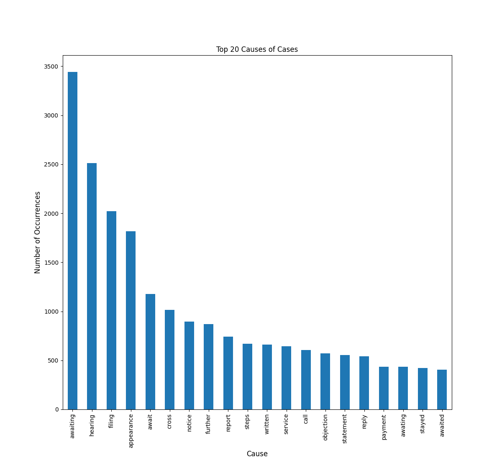
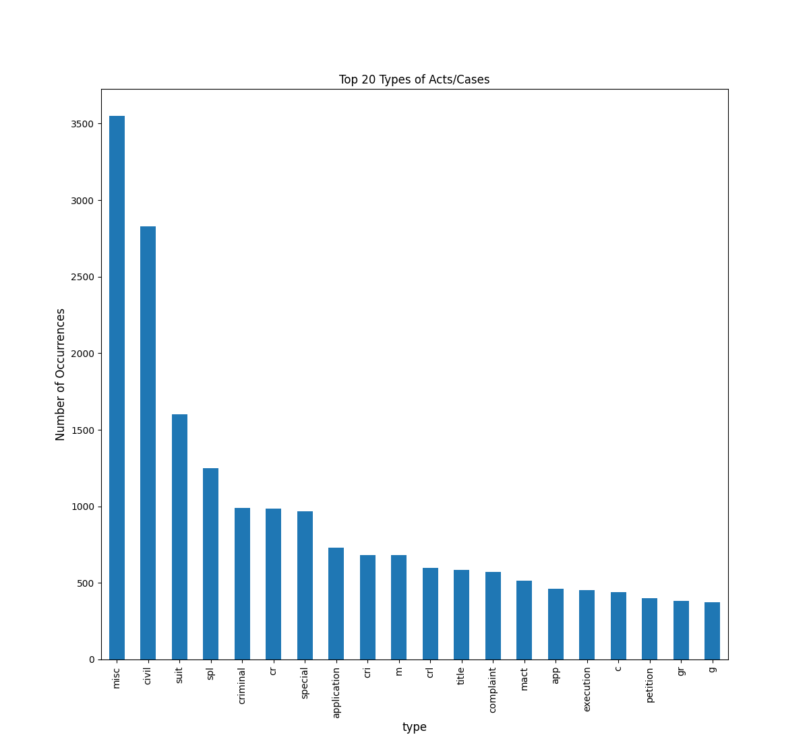
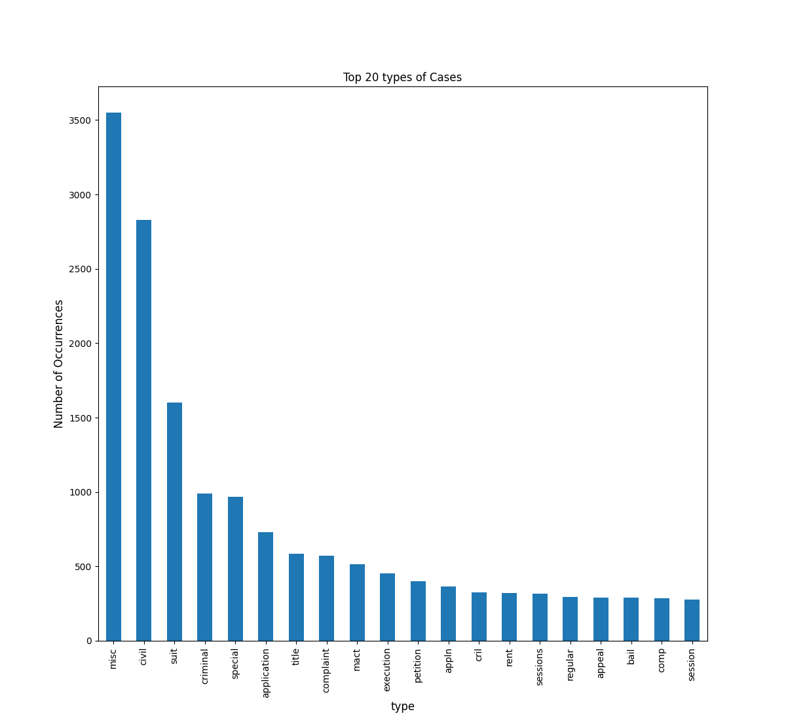
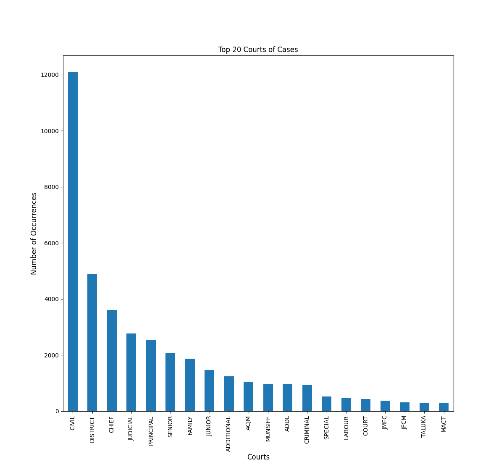

# Analysis of Court Data

### Folder Structure

The folder structure is as follows:

        .
        ├── README.md
        ├── submission.zip
        |   └── submission
        │       ├── judge_case.csv
        │       ├── judges_clean.csv
        │       ├── purpose_name_key.csv
        │       ├── section_key.csv
        │       └── type_name_key.csv
        ├── top20_causes.png
        ├── top20_Courts.png
        ├── top20_type.png
        └── top20_types2.png

### Instruction to run the code

Download the zip file from https://github.com/Srijan-Chak012/Analysis-of-Court-Data 

or

Clone the repository using the following command:

    git clone https://github.com/Srijan-Chak012/Analysis-of-Court-Data.git 
    or
    git clone git@github.com:Srijan-Chak012/Analysis-of-Court-Data.git

After this, unzip the submissions.zip file and go to the folder `submission`.

The codes are written in Jupyter Notebook, using a kernel with Python 3.10. The codes can be run individually.

Note: The file act_analysis.ipynb will lead to an error as the csv file, `acts_sections.csv` was too large to upload on Github. It can be downloaded from https://www.dropbox.com/sh/hkcde3z2l1h9mq1/AAB2U1dYf6pR7qij1tQ5y11Fa/csv?dl=0&subfolder_nav_tracking=1 and then analysed using the code.

### Classification Problem

I thought the gender of the positional judge could be a potentially interesting classification problem. A cursory reading of the dataset indicated that the column `female_judge` has been populated with a binary value of 1 or 0. A glance at the csv file also showed that the column `judge_position` has been populated with a string value, an indication of how important . I thought that the string value could be a good feature to use in a classification model. Furthermore, there is a predominance of passing over female judges when it comes to promotions in the Indian Judiciary system. I thought that this could be a good classification problem to explore. I also felt that `state_code` could be a good feature to use in the classification model as there have been newpaper articles and reports which talk about how some states are more likely to pass over women for promotions.

I first found out the correlation between the `female_judge` and `judge_position` columns. The value was `-0.018` which signifies a very very weak correlation between the two columns, and also shows that there is presence of inverse relations between the two columns. Next, I found the correlation between `female_judge` and `state_code` columns. The value was `-0.027` which once again signifies a very very weak correlation between the two columns, and also shows that there is presence of inverse relations between the two columns.

Next, this classification problem is a binary classification problem as I give in a maximum of two parameters (`judge_position` and `state_code`). I ran 4 classification models on the dataset. The models were:
- Logistic Regression
- K Nearest Neighbors
- Stochastic Gradient Descent
- Gaussian Naive Bayes

##### Why Logistic Regression?
Logistic regression was developed for classification and is best helpful for determining the impact of several independent factors on a single outcome variable. Since the correlation values gave such low values that they were essentially negligible, I thought that logistic regression would be a good model to use.

The baseline (all the features used for classification), accuracy was calculated to be 0.689, indicating that the model might not be the best for classifying the dataset. Using only `judge_position` as a feature, the accuracy was calculated to be 0.694, indicating that given the model, the feature is pretty good for classifying the dataset. Using both `judge_position` and `state_code` as features, the accuracy was calculated to be 0.694, helping us arrive to the same conclusion as before. The average time to give these results were 2.7s.

##### Why K Nearest Neighbors?
KNN is a non-parametric method used for classification and regression. It is a lazy learner algorithm as it does not learn a discriminative function from the training data but memorizes the training dataset instead. It is a good model to use when the number of features is small. Given the above reason, I thought that KNN would be a good model to use.

The baseline (all the features used for classification), accuracy was calculated to be 0.689, indicating that the model might not be the best for classifying the dataset. Using only `judge_position` as a feature, the accuracy was calculated to be 0.693, indicating that given the model, the feature is pretty good for classifying the dataset. Using both `judge_position` and `state_code` as features, the accuracy was calculated to be 0.687, helping us arrive to the same conclusion as before. The average time to give these results were 2.33s.

##### Why Stochastic Gradient Descent?
Stochastic Gradient Descent is a linear classifier which is used for classification. It is a good model to use when the dataset is large. Given the above reason, I thought that SGD would be a good model to use.

The baseline (all the features used for classification), accuracy was calculated to be 0.685, indicating that the model might not be the best for classifying the dataset. Using only `judge_position` as a feature, the accuracy was calculated to be 0.693, indicating that given the model, the feature is pretty good for classifying the dataset. Using both `judge_position` and `state_code` as features, the accuracy was calculated to be 0.694, helping us arrive to the same conclusion as before. The average time to give these results were 7.47s.

##### Why Gaussian Naive Bayes?
Naive Bayes method based on Bayes' theorem with the premise that every pair of characteristics are independent. Naive Bayes classifiers are effective in a variety of real-world applications, including document categorization and spam filtering. In comparison to more complex algorithms, Naive Bayes classifiers are incredibly quick.

The baseline (all the features used for classification), accuracy was calculated to be 0.96, indicating that the model might be excellent for classifying the dataset. Using only `judge_position` as a feature, the accuracy was calculated to be 0.694, indicating that given the model, the feature is not very good for classifying the dataset. Using both `judge_position` and `state_code` as features, the accuracy was calculated to be 0.694, helping us arrive to the same conclusion as before. The average time to give these results were 1.27s.

### Other Interesting Observations

##### Observations in the judge_case csv file

To make observations in the data, we can see where the filing judge is the same as the decision judge which comes to be around 66%. Through a more sociological survey, we can find out more about the procedure that needs to be followed, the pros and cons of each procedure and if one way is better than the other. 

##### Observations in the section_key csv file

I did not find any interesting observations in the data. However, I did think that the secions column needed preprocessing by removing unnecessary punctuation, which would further help in the analysis of the data.

##### Observations in the purpose_name_key

This file was very interesting and gave an insight into what are the most common cases listed in the database. The most causes were found out by parsing the first word of the purpose_name column. I then depicted the top 20 causes in a bar graph. I considered words with a string length of 4 or more to be a cause (thus, effectively ignoring the numbers and acts). Thus, we can see on the graph there were several writ petitions, case filings and notices. However, the most common causes came out to be Awaiting/Awaited and Hearing.

##### Observations in the type_name_key csv file

This file was very interesting and gave an insight into what are the most common types of cases listed in the database. The most types were found out by parsing the first word of the purpose_name column. I then depicted the top 20 types in a bar graph. For the first graph, I considered all types of cases, without posing a restriction on string length. However, this resulted in a lot of random data, and can possibly lead to erroneous interpretations. That is why, we can see many illegible results on the graph such as cr., c, g and so on. Thus, I made another graph in which I considered the string length as greater than 3 (similar to what we did previously). Here, we get more comprehensible results, most of them having full words. We can see on the graph there were several petitions, complaints and sessions. However, the most common causes turned out to be miscellaneous and civil cases.

##### Observations in the cases_court csv file

This file was very interesting and gave an insight into what are the most common type of courts listed in the database. The most types of courts were found out by parsing the first word of the court_name column. I then depicted the top 20 courts in a bar graph. I considered words with a string length of 4 or more to be a court (thus, effectively ignoring the numbers and acts). Thus, we can see on the graph there were several Additional, Principal and Special Courts. However, the most common type of courts came out to be Civil and District. Following this up with a sociological analysis, helps us understand the deep level of decentralisation in the judicial system of India and how many number of cases they handle on an everyday basis, underlying the need for such a system.

